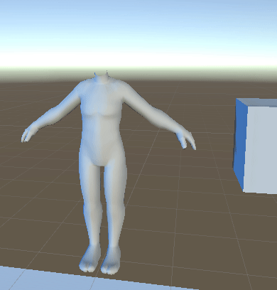

# SkeletonSkin

## Usage

I'm using this to attach equipment (shirts, like this BOX) to character bodies.

1. Attach a `SkeletonSkin` component to each skinned mesh renderer __you want to move to another matching skeleton__.

2. Click the `Precache` button, this will build the list of bones used for lookup later.

3. Attach a `Skeleton` component to the skeleton (rig) __you want to attach to__.
Assign the root bone, and click the `Precache` button.

4. Call `skeleton.EquipSkin(skin)`, this will move the skin to be a child of skeleton, and remap the skin to use the skeletons matched bones.

## Notes
- Uses __Naughty Attributes__ instead for a button.

- Uses lists now instead of dictionaries, which serialize properly at edit time.
